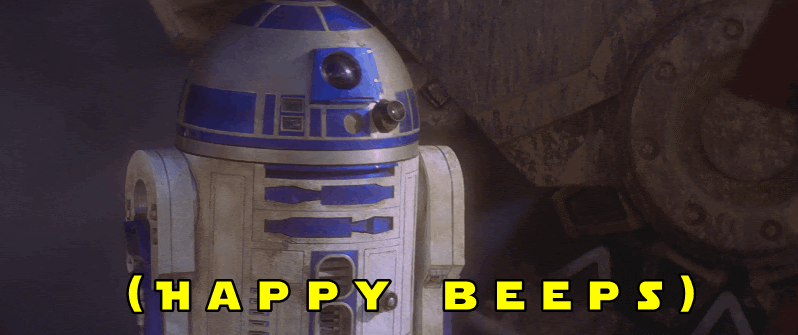

# R2D2 Assistant

> [R2D2 image was originally copied from here](https://www.google.com/url?sa=i&url=http%3A%2F%2Fstayontheleader.blogspot.com%2F2018%2F07%2F12-mainly-star-wars-pictures-that.html&psig=AOvVaw1cQpKcLtzAdGLsDC2b0J1h&ust=1620159827269000&source=images&cd=vfe&ved=0CAIQjRxqFwoTCODfpOqrrvACFQAAAAAdAAAAABAD)

This is a companion project to my presentation at RVAJS on creating a JavaScript Virtual Assistant. You can get to the meetup invite link at https://www.meetup.com/rva-js/events/szjphrycchbgb/

I also created a blog post on this, which I will share soon with a link.

If you want to follow along, I have created branches for each of the different steps in setting up the project.

After doing a clone, you can pull down the different branches and see the repo updated.

- `step-1`
  - this is the initial setup with a bare bones HTTP endpoint that just returns an HTTP message when called
- `step-2`
  - this pulls in the Twilio Helper package and also will return a message to the person sending it
- `step-3`
  - this includes the `serverless.yml` configuration for the project to build out a Dynamo DB table for the "To Do" list storage
- `step-4`
  - this builds out the helper methods and pulls in the `aws-sdk` which allows for messages that come in to create "To Do" items with create, view, and delete options

If you have additional questions, feel free to reach out to me at [andrewevans.dev](https://www.andrewevans.dev)
